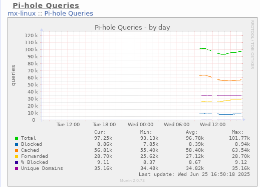

# Munin Plugin for Pi-hole v6 API

This plugin fetches Pi-hole v6 DNS statistics using the new REST API and displays them in Munin.

## Features

- Supports Pi-hole v6 session-based authentication
- Displays:
  - Total queries
  - Blocked queries
  - Cached queries
  - Forwarded queries
  - Percentage blocked
  - Unique domains

## Requirements

- `bash`
- `curl`
- `jq`
- Munin node on Linux (tested on Debian/MX)

## Setup

1. Copy the plugin script into your Munin plugins directory:

   ```bash
   sudo cp pihole_queries /usr/share/munin/plugins/
   sudo chmod +x /usr/share/munin/plugins/pihole_queries
   ```

2. Create a symbolic link:

   ```bash
   sudo ln -s /usr/share/munin/plugins/pihole_queries /etc/munin/plugins/pihole_queries
   ```

3. Configure environment variables in Munin’s plugin config:

   ```ini
   # /etc/munin/plugin-conf.d/pihole
   [pihole_queries]
   env.PIHOLE_URL https://your.pihole.domain
   env.PASSWORD "your_secure_password"
   ```

   ⚠️ **Do not hardcode passwords in the script. Always use Munin's env config.**

4. Restart Munin node:

   ```bash
   sudo service munin-node restart
   ```

5. Wait a few minutes for Munin to collect data, or run manually to test:

   ```bash
   sudo munin-run pihole_queries
   ```

## Sample Graph Output




   


## Security Note

- This script will fail with a clear error message if environment variables are missing.

## License

MIT License
